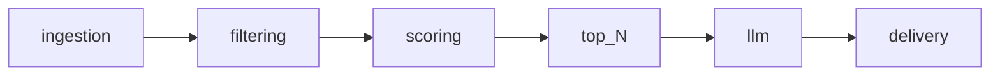

# Architecture

## Pipeline

- **ingestion**: Fetch or parse new articles (`HabrIngestion` protocol). **Demo:** `StubHabrIngestion` (synthetic article). **Normal:** `RssHabrIngestion` + JSON `SeenArticleStore` for cross-run dedup. URLs are normalized (https, strip tracking query); stable `id` is `habr:article:<digits>` when the Habr path matches `/articles/NNNNNN/`. Multiple feeds merge by stable id with per-feed logging.
- **filtering**: Reduce candidates (`ArticleFilter`). **Default:** `HeuristicArticleFilter` — substring rules on title/summary/RSS categories; exclude wins; optional include OR-gate when include lists are non-empty. **Preset:** optional JSON at `config/default_radar.json` merged via `apply_preset_env_overlay` for fields not set in env/`.env`.
- **scoring**: Assign points (`ArticleScoring`). **Default:** `HeuristicArticleScoring` — integer weights, tiered strong/technical/include, title bonus, recency, negative penalties; `ScoreExplanation` on each `ArticleScore`.
- **selection**: After scoring, `select_top_scored` sorts by points, publish time, id and keeps top `HTR_MAX_SELECTED_ARTICLES`.
- **llm**: Optional enrichment (`LLMEnrichment`; `NoOpLLMEnrichment`).
- **delivery**: Notify (`TelegramDelivery`; default `HttpTelegramDelivery` — при `HTR_DRY_RUN` лог с HTML-текстом без HTTP, иначе `sendMessage` в Telegram; опционально **дневной лимит** реальных отправок через `DailyDeliveryBudget` JSON).

## Configuration precedence

1. Process environment and `.env` (pydantic-settings; explicit fields win).
2. If `HTR_PRESET_ENABLED=true` and not demo: JSON preset (`HTR_PRESET_PATH`, default `config/default_radar.json`; packaged fallback if file missing) fills only **unset** fields.

## Code map

| Path                              | Role                                                   |
| --------------------------------- | ------------------------------------------------------ |
| `src/habr_tech_radar/settings.py` | `pydantic-settings`, env prefix `HTR_`                 |
| `src/habr_tech_radar/config/preset.py` | Load/merge JSON radar preset                      |
| `src/habr_tech_radar/url_utils.py` | Shared URL cleaning (tracking query params)          |
| `src/habr_tech_radar/ingestion/normalize.py` | Habr URL + stable article id                  |
| `src/habr_tech_radar/pipeline.py` | `run_pipeline`, `default_components`                   |
| `src/habr_tech_radar/state/`      | `SeenArticleStore`, `DailyDeliveryBudget`, `last_run`   |
| `src/habr_tech_radar/models/`     | `Article`, `FilterResult`, `ArticleScore`, `ScoreExplanation`, `RadarItem` |
| `src/habr_tech_radar/selection.py` | `select_top_scored` (order + cap)                         |
| `config/default_radar.json`       | Default tech-radar preset (include lists, max_selected) |

## Design choices

- **Protocols** for service boundaries; **stub** implementations where integrations are not ready yet.
- **RSS HTTP** in normal mode (`RssHabrIngestion`); **no network** in demo mode or when `HTR_HABR_RSS_URLS` is empty.
- **Demo mode** (`HTR_DEMO_MODE` or `--demo`) injects one synthetic article for pipeline testing; preset merge is skipped.
- **Stage 2** (comment drafts) is explicitly out of scope in this repository.
