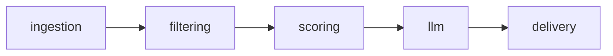

# Architecture

## Pipeline

- **ingestion**: Fetch or parse new articles (`HabrIngestion` protocol; `StubHabrIngestion` for local dev).
- **filtering**: Reduce candidates (`ArticleFilter`; stub pass-through).
- **scoring**: Rank or score (`ArticleScoring`; stub fixed score).
- **llm**: Optional enrichment (`LLMEnrichment`; `NoOpLLMEnrichment`).
- **delivery**: Notify (`TelegramDelivery`; `LogOnlyTelegramDelivery` logs only).

## Code map

| Path                              | Role                                                   |
| --------------------------------- | ------------------------------------------------------ |
| `src/habr_tech_radar/settings.py` | `pydantic-settings`, env prefix `HTR_`                 |
| `src/habr_tech_radar/pipeline.py` | `run_pipeline`, `default_components`                   |
| `src/habr_tech_radar/models/`     | `Article`, `FilterResult`, `ArticleScore`, `RadarItem` |
| `config/`                         | Reserved for future rules files (not read yet)         |

## Design choices

- **Protocols** for service boundaries; **stub** implementations for safe default runs.
- **No network** unless real implementations replace stubs.
- **Demo mode** (`HTR_DEMO_MODE` or `--demo`) injects one synthetic article for pipeline testing.

