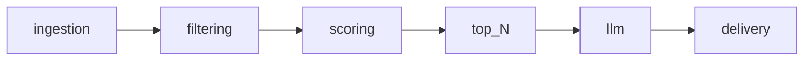

# Architecture

## Pipeline

- **ingestion**: Fetch or parse new articles (`HabrIngestion` protocol). **Demo:** `StubHabrIngestion` (synthetic article). **Normal:** `RssHabrIngestion` + JSON `SeenArticleStore` for cross-run dedup.
- **filtering**: Reduce candidates (`ArticleFilter`). **Default:** `HeuristicArticleFilter` — substring rules on title/summary/RSS categories; exclude wins; optional include OR-gate when include lists are set.
- **scoring**: Assign points (`ArticleScoring`). **Default:** `HeuristicArticleScoring` — integer weights, title bonus, recency; `ScoreExplanation` on each `ArticleScore`.
- **selection**: After scoring, `select_top_scored` sorts by points, publish time, id and keeps top `HTR_MAX_SELECTED_ARTICLES`.
- **llm**: Optional enrichment (`LLMEnrichment`; `NoOpLLMEnrichment`).
- **delivery**: Notify (`TelegramDelivery`; default `HttpTelegramDelivery` — при `HTR_DRY_RUN` лог с HTML-текстом без HTTP, иначе `sendMessage` в Telegram; `LogOnlyTelegramDelivery` остаётся вспомогательной заглушкой).

## Code map

| Path                              | Role                                                   |
| --------------------------------- | ------------------------------------------------------ |
| `src/habr_tech_radar/settings.py` | `pydantic-settings`, env prefix `HTR_`, layered `config/defaults.env` + `.env` |
| `src/habr_tech_radar/pipeline.py` | `run_pipeline`, `default_components`                   |
| `src/habr_tech_radar/state/`      | `SeenArticleStore` (seen article IDs JSON file)        |
| `src/habr_tech_radar/models/`     | `Article`, `FilterResult`, `ArticleScore`, `ScoreExplanation`, `RadarItem` |
| `src/habr_tech_radar/selection.py` | `select_top_scored` (order + cap)                         |
| `config/`                         | `defaults.env` (non-secret defaults); optional future rules files |

## Design choices

- **Protocols** for service boundaries; **stub** implementations where integrations are not ready yet.
- **RSS HTTP** in normal mode (`RssHabrIngestion`); **no network** in demo mode or when `HTR_HABR_RSS_URLS` is empty.
- **Demo mode** (`HTR_DEMO_MODE` or `--demo`) injects one synthetic article for pipeline testing.

