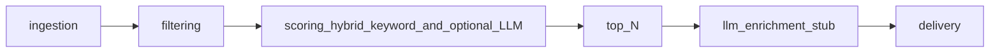

# Architecture

## Pipeline

**Note:** Optional **OpenAI scoring** runs inside **`HeuristicArticleScoring`** (not as a separate pipeline stage). The **`llm`** stage after ranking is **`LLMEnrichment`** only — currently **`NoOpLLMEnrichment`** (future optional enrichment, separate from scoring).

- **ingestion**: Fetch or parse new articles (`HabrIngestion` protocol). **Demo:** `StubHabrIngestion` (synthetic article). **Normal:** `RssHabrIngestion` + JSON `SeenArticleStore` for cross-run dedup.
- **filtering**: Reduce candidates (`ArticleFilter`). **Default:** `HeuristicArticleFilter` — substring rules on title/summary/RSS categories; exclude wins; optional include OR-gate when include lists are set.
- **scoring**: Assign points (`ArticleScoring`). **Default:** `HeuristicArticleScoring` — keyword/heuristic signals capped to **0..50**; optional LLM contribution **0..50** when `HTR_LLM_SCORING_ENABLED`, `HTR_OPENAI_API_KEY`, and **keyword score ≥ `HTR_LLM_KEYWORD_THRESHOLD`** (default 20); total **`ArticleScore.points` 0..100**. If full article fetch is off or fails, LLM uses **fallback context** (title, summary, categories, etc.). `ScoreExplanation` documents the breakdown; the model clamps explanation fields to the same contract.
- **selection**: After scoring, `select_top_scored` sorts by `ArticleScore.points`, publish time, id and keeps top `HTR_MAX_SELECTED_ARTICLES`.
- **llm (enrichment)**: Post-rank hook (`LLMEnrichment`; **`NoOpLLMEnrichment`** in `default_components`). Not used for scoring.
- **delivery**: Notify (`TelegramDelivery`; default `HttpTelegramDelivery` — при `HTR_DRY_RUN` лог с HTML-текстом без HTTP, иначе `sendMessage` в Telegram; `LogOnlyTelegramDelivery` остаётся вспомогательной заглушкой).

## Code map

| Path                              | Role                                                   |
| --------------------------------- | ------------------------------------------------------ |
| `src/habr_tech_radar/settings.py` | `pydantic-settings`, env prefix `HTR_`, layered `config/defaults.env` + `.env` |
| `src/habr_tech_radar/pipeline.py` | `run_pipeline`, `default_components`                   |
| `src/habr_tech_radar/state/`      | `SeenArticleStore` (seen article IDs JSON file)        |
| `src/habr_tech_radar/models/`     | `Article`, `FilterResult`, `ArticleScore`, `ScoreExplanation`, `RadarItem` |
| `src/habr_tech_radar/selection.py` | `select_top_scored` (order + cap)                         |
| `config/`                         | `defaults.env` (non-secret defaults); optional future rules files |

## Design choices

- **Protocols** for service boundaries; **stub** implementations where integrations are not ready yet.
- **RSS HTTP** in normal mode (`RssHabrIngestion`); **no network** in demo mode or when `HTR_HABR_RSS_URLS` is empty.
- **Demo mode** (`HTR_DEMO_MODE` or `--demo`) injects one synthetic article for pipeline testing.

